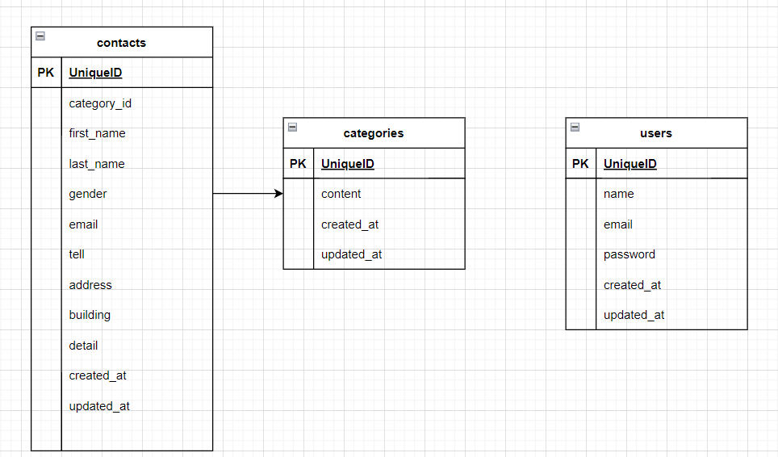

# お問い合わせフォーム

## 環境構築

### Dockerビルド
1. git clone https://github.com/Chayney/contactform
2. docker-compose up -d -build

### Laravel環境構築
1. docker-compose exec php bash
2. composer install
3. .env.exampleファイルから.envを作成し、環境変数を変更
4. php artisan key:generate
5. php artisan migrate
6. php artisan db:seed

## 使用技術
1. PHP 8.3.6
2. Laravel v8.83.8
3. mysql:8.0.26

## ER図

## URL
1. 開発環境: http://localhost/
2. phpMyadmin: http://localhost:8080/